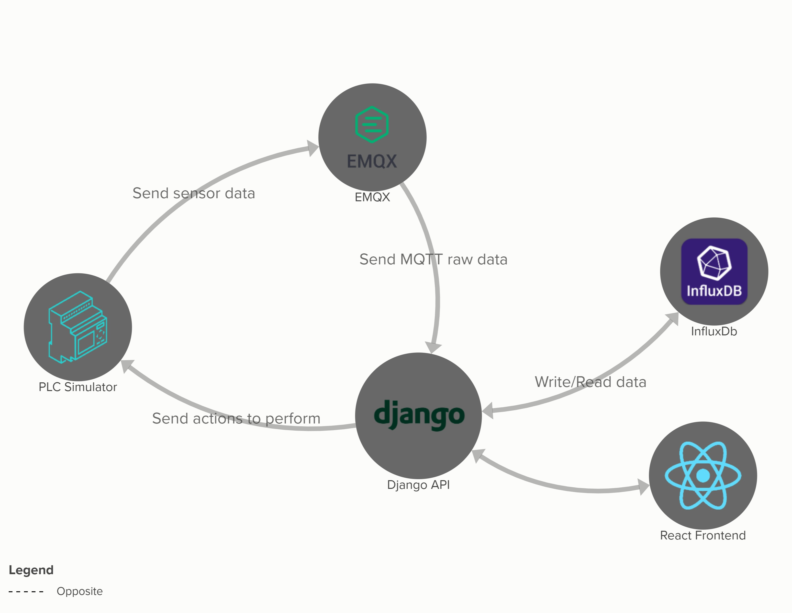

# Backend

## API
Progetto django che gestisce le API per il frontend, la connessione con influxdb e la gestione del simulatore

### Come funziona
Django fornisce degli endpoint che il frontend utilizza per avviare o fermare un simulatore. 
Quando il frontend invia il comando per avviare una simulazione viene avviato un thread che inizia
ad inviare una serie di dati via MQTT ad un broker.

I dati inviati al broker vengono poi inoltrati 
a django attraverso un webhook per poi essere salvati in un database influxb.

Dal frontend è possibile anche visualizzare i dati inviati dal simulatore che verranno presi da influxDb.

### Come avviare Django
Al il progetto è ancora in fase DEV quindi per avviarlo basterà portarsi nella cartella `api` ed avviare il progetto con `python manage.py runserver`

In questo modo vi si potrà accedere solo da `http://127.0.0.1:8000`. Se lo si vuole avviare per che sia raggiungibile anche da altri computer
avviare con `python manage.py runserver 0.0.0.0:8000`

### Mappa del sistema

<iframe src="https://embed.kumu.io/f0b00ab5c780b721d67cc7c889ea4d3e" width="940" height="600" frameborder="1"></iframe>

## SIMULATORE
Il simulatore è integrato nelle [API](#api) ed è composto da un array di thread.

Ogni thread rappresenta un silos, che invia dati via MQTT al broker, può essere avviato, fermato, riempire, svuotare un silos o rimanere in IDLE.

Se il simulatore rimane in IDLE i dati dei sensori di temperature, ph, pressione cambiano, mentre il livello resta alla sua ultima misurazione

## ENDPOINTS
Gli endpoints sono listati a [questo](docs/endpoints.md) link

é possibile richiedere il token attraverso l'endpoint `/auth` passando username e password come payload.

NB: TUTTI gli endpoint richiedono l'authenticazione tramite header. `Authorization: Token <TOKEN>`.