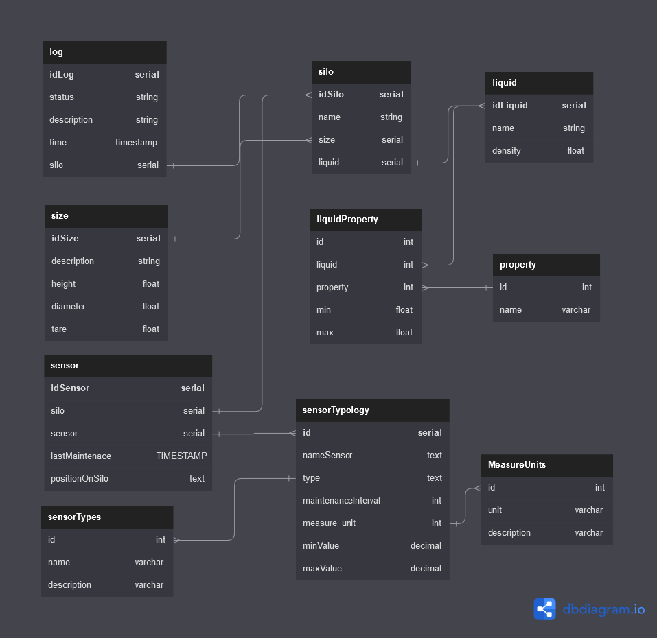

# PostgreSQL
The database used is PostgreSQL, it is a relational database that is used to store the data of the silos and the users.

The records are managed by the API module, which exposes the REST APIs to the frontend.
## Database schema

